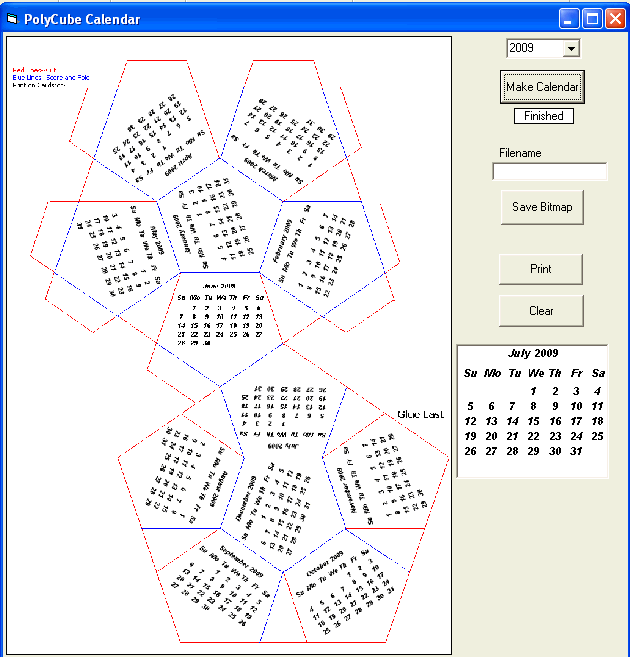



## PolyCube Calendar \(Update\)

### Description

This is a crude attempt at making poly calendars, that you can cut out and paste together.There has to be better ways to do this, so I'm just putting the idea out there with the hopes someone will do a better job and post it.

Added: save as jpeg and Monday first option.Added weekend colored option.
 
### More Info
 

             |
---                |---
**Submitted On**   |2009-05-29 07:56:00
**By**             |[Kenneth Foster](https://github.com/Planet-Source-Code/PSCIndex/blob/master/ByAuthor/kenneth-foster.md)
**Level**          |Intermediate
**User Rating**    |4.8 (19 globes from 4 users)
**Compatibility**  |VB 6\.0
**Category**       |[Miscellaneous](https://github.com/Planet-Source-Code/PSCIndex/blob/master/ByCategory/miscellaneous__1-1.md)
**World**          |[Visual Basic](https://github.com/Planet-Source-Code/PSCIndex/blob/master/ByWorld/visual-basic.md)
**Archive File**   |[PolyCube\_C2153625292009\.zip](https://github.com/Planet-Source-Code/kenneth-foster-polycube-calendar-update__1-72097/archive/master.zip)

